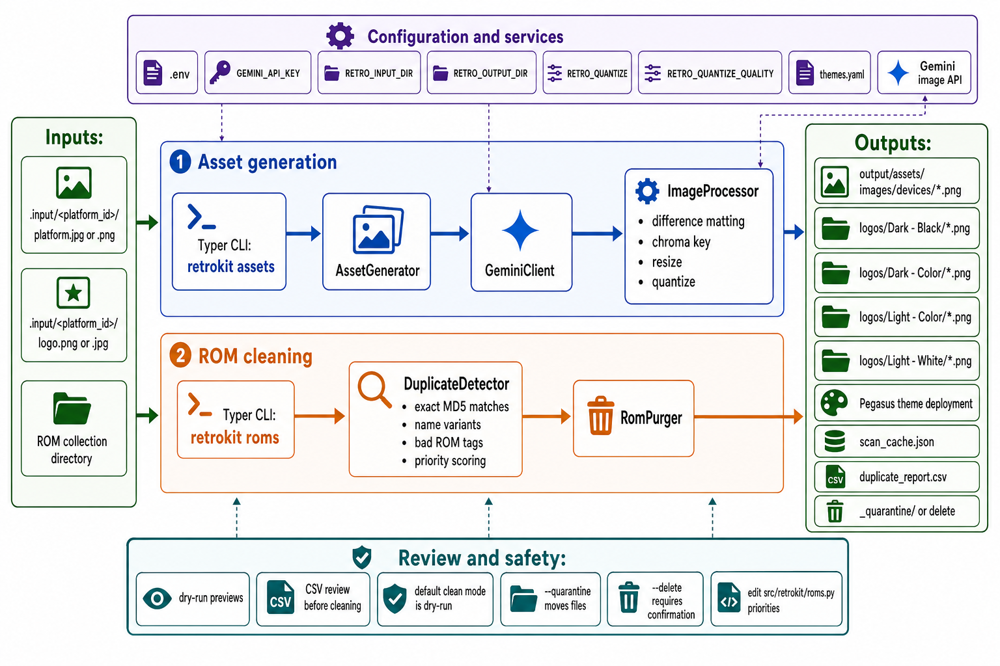

<div align="center">
  

  # retrokit

  **🎮 Retro gaming toolkit — AI-powered platform asset generation and smart ROM collection cleaning 🧰**
</div>

retrokit is a Python CLI for preparing retro gaming libraries. It generates Pegasus Frontend platform artwork from reference images with Gemini, and it scans ROM folders for duplicate or low-quality variants before you remove them.

Asset generation is built around a local input folder, a Gemini API key, and a theme deployment config. ROM cleaning is local-first: scan, review the CSV report, then quarantine or delete.

## Install

```bash
git clone https://github.com/tsilva/retrokit.git
cd retrokit
uv tool install .
cp .env.example .env
```

Set `GEMINI_API_KEY` in `.env` before running asset generation commands.

## Commands

```bash
retrokit assets generate amigacd32 "Commodore Amiga CD32"  # generate device and logo assets
retrokit assets list                                       # list generated platforms
retrokit assets themes --init                              # create themes.yaml
retrokit assets deploy amigacd32 --theme colorful          # copy generated assets into a theme
retrokit assets deploy --dry-run                           # preview deployment
retrokit assets config                                     # show asset configuration

retrokit roms scan --roms-dir /path/to/roms                # scan ROMs and write scan_cache.json
retrokit roms report --roms-dir /path/to/roms              # write duplicate_report.csv
retrokit roms clean --roms-dir /path/to/roms --dry-run     # preview removals from the report
retrokit roms clean --roms-dir /path/to/roms --quarantine  # move removals into _quarantine/
retrokit roms clean --roms-dir /path/to/roms --delete      # permanently delete after confirmation
```

For development checks:

```bash
uv sync --extra dev
uv run ruff check .
uv run mypy src/retrokit main.py
uv run pytest
```

## Notes

- Asset references live in `.input/<platform_id>/` as `platform.jpg` or `platform.png` plus `logo.png`, `logo.jpg`, or `logo.jpeg`.
- Generated assets are written under `output/assets/images/` by default: 2160x2160 device PNGs and four 1920x510 logo variants for dark and light themes.
- Theme deployment reads `themes.yaml` from the current directory, the project root, or `~/.config/retrokit/themes.yaml`.
- ROM scans write `scan_cache.json`; reports write `duplicate_report.csv`; cleaning reads the report rather than rescanning.
- ROM cleaning prefers clean dumps, verified tags, higher-priority regions, newer revisions, and preferred per-platform formats. Tune those rules in `src/retrokit/roms.py`.
- `main.py` is the original standalone ROM dedup script. The packaged CLI path is `src/retrokit/`.

## Architecture



## License

[MIT](LICENSE)
