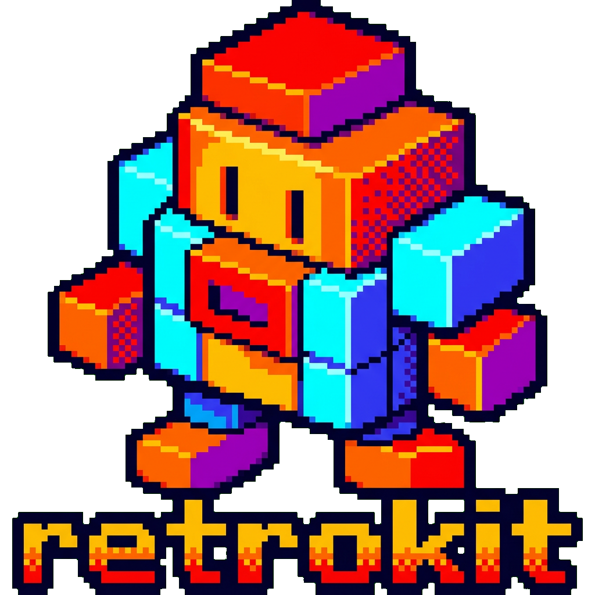

<div align="center">
  

  # retrokit

  [](https://github.com/tsilva/retrokit/actions/workflows/release.yml)
  [](https://www.python.org/)
  [](LICENSE)

  **🎮 Retro gaming toolkit — AI-powered platform asset generation and smart ROM collection cleaning 🧰**

</div>

## ✨ Features

### 🖼️ Asset Generation

Generate high-quality platform assets for retro gaming front-ends using Gemini AI:

- **Device images** — Photorealistic 2160x2160 renders of consoles, handhelds, and arcade cabinets from reference photos
- **Logo variants** — 4 theme-ready logo variations (dark/light × color/monochrome) at 1920x510
- **Transparent backgrounds** — Advanced alpha extraction via difference matting and chroma keying
- **PNG optimization** — Automatic quantization via libimagequant for smaller file sizes
- **Theme deployment** — Deploy generated assets directly to Pegasus Frontend themes

### 🧹 ROM Cleaning

Deduplicate and clean retro ROM collections:

- **Hash-based deduplication** — Finds exact duplicates via MD5 matching
- **Region priority** — Keeps USA > Europe > Japan > World variants
- **Revision detection** — Automatically keeps the latest revision
- **Bad dump removal** — Removes betas, prototypes, hacks, and bad dumps
- **Format preferences** — Keeps preferred formats per platform (e.g., `.d64` for C64)
- **Safe by default** — Dry-run mode shows changes before any files are touched

## 🚀 Quick Start

### Installation

```bash
# Using uv (recommended)
uv tool install .

# Or with pip
pip install .
```

### Generate Platform Assets

```bash
# Set up your Gemini API key
export GEMINI_API_KEY=your_key_here

# Place reference images in .input/<platform_id>/
# Needs: platform.jpg (device photo) + logo.png (official logo)

# Generate assets for a platform
retrokit assets generate n64 "Nintendo 64"

# Deploy to a Pegasus theme
retrokit assets deploy n64 --theme colorful
```

### Clean ROM Collections

```bash
# Scan and preview what would be removed (safe, read-only)
retrokit roms scan --roms-dir /path/to/roms

# Generate a CSV report of duplicates
retrokit roms report --roms-dir /path/to/roms

# Move duplicates to quarantine folder
retrokit roms clean --roms-dir /path/to/roms --quarantine

# Permanently delete duplicates
retrokit roms clean --roms-dir /path/to/roms --delete
```

## 📖 Usage

### Asset Commands

| Command | Description |
|---------|-------------|
| `retrokit assets generate <id> "<name>"` | Generate device image + logo variants from references |
| `retrokit assets list` | Show all generated platforms |
| `retrokit assets deploy [id] --theme <name>` | Deploy assets to a theme directory |
| `retrokit assets themes --init` | Create default `themes.yaml` configuration |
| `retrokit assets config` | Show current configuration |

### ROM Commands

| Command | Description |
|---------|-------------|
| `retrokit roms scan` | Scan ROMs directory for duplicates |
| `retrokit roms report` | Generate CSV duplicate report |
| `retrokit roms clean --dry-run` | Preview what would be removed |
| `retrokit roms clean --quarantine` | Move duplicates to `_quarantine/` |
| `retrokit roms clean --delete` | Permanently delete duplicates |

### Common Options

| Flag | Applies To | Description |
|------|-----------|-------------|
| `--roms-dir PATH` | `roms *` | Specify ROMs directory |
| `--platform NAME` | `roms scan` | Process only a specific platform |
| `--no-hash` | `roms scan` | Skip MD5 computation for faster scanning |

## 🏗️ How It Works

### Asset Generation Pipeline

```
.input/<platform_id>/
├── platform.jpg          # Reference photo of the device
└── logo.png              # Official platform logo
         │
         ▼
    Gemini AI generates assets from references
         │
         ▼
    Image processing (transparency extraction, resizing, quantization)
         │
         ▼
output/assets/images/
├── devices/<platform_id>.png              # 2160x2160 device render
└── logos/
    ├── Dark - Black/<platform_id>.png     # White monochrome
    ├── Dark - Color/<platform_id>.png     # Color on dark
    ├── Light - Color/<platform_id>.png    # Color on light
    └── Light - White/<platform_id>.png    # Black monochrome
```

### ROM Duplicate Detection

The tool identifies duplicates in three phases:

1. **Exact hash matches** — Files with identical MD5 hashes
2. **Name-based matches** — Same game, different variants (region, revision, format)
3. **Bad ROM removal** — Betas, prototypes, hacks, and bad dumps

Priority scoring when choosing which ROM to keep:

| Factor | Priority |
|--------|----------|
| Bad dump status | Clean > Bad |
| Source variant | Original > Virtual Console/Mini |
| Good dump tag `[!]` | Verified > Unverified |
| Region | USA > Europe > Japan > World |
| Revision | Higher > Lower |

## ⚙️ Configuration

### Environment Variables

| Variable | Required | Default | Description |
|----------|----------|---------|-------------|
| `GEMINI_API_KEY` | Yes (for assets) | — | Google Gemini API key |
| `RETRO_INPUT_DIR` | No | `.input` | Reference images directory |
| `RETRO_OUTPUT_DIR` | No | `output` | Generated assets directory |
| `RETRO_QUANTIZE` | No | `true` | Enable PNG quantization |

Copy `.env.example` to `.env` to configure.

### Theme Deployment

Create a `themes.yaml` to define where assets are deployed:

```yaml
themes:
  colorful:
    base_path: "~/themes/COLORFUL"
    assets_dir: "assets/images/{platform_id}"
    files:
      device: "device.png"
      logo_dark_color: "logo_dark_color.png"
      logo_dark_black: "logo_dark_black.png"
      logo_light_color: "logo_light_color.png"
      logo_light_white: "logo_light_white.png"
```

Run `retrokit assets themes --init` to generate a default configuration.

### ROM Cleaning

Edit these constants in `src/retrokit/roms.py` to customize deduplication behavior:

| Constant | Purpose | Default |
|----------|---------|---------|
| `REGION_PRIORITY` | Region ranking | USA > Europe > Japan > World |
| `REMOVE_TAGS` | Tags marking bad ROMs | Beta, Proto, Pirate, Demo... |
| `REMOVE_BRACKET_TAGS` | Bracket tags for bad dumps | `[h]`, `[b]`, `[p]`, `[t]`... |
| `PREFERRED_FORMATS` | Per-platform format preference | C64: `.d64`, Amiga: `.adf`... |
| `SKIP_PLATFORMS` | Platforms to skip entirely | MS-DOS, ScummVM, Windows |

## 🤝 Contributing

Contributions are welcome! Please feel free to submit a Pull Request.

## 📄 License

MIT
